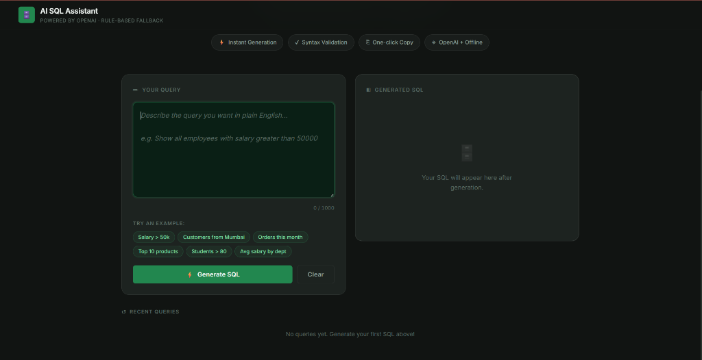

# 🗄️ AI SQL Assistant

> Convert plain English into executable SQL queries — instantly.

[](https://python.org)
[](https://flask.palletsprojects.com)
[](https://openai.com)
[](LICENSE)

---

## 🖼️ Preview



---

## ✨ Features

| Feature | Description |
|---|---|
| 🤖 AI Generation | OpenAI `gpt-4o-mini` converts English → SQL |
| ⚙️ Offline Fallback | Rule-based engine when no API key is set |
| 🎨 Syntax Highlighting | Color-coded SQL output |
| ✅ SQL Validation | Checks keywords, semicolons, clauses |
| 📋 Copy Button | One-click clipboard copy |
| 🕑 History | Last 8 queries saved in localStorage |
| 📱 Responsive | Works on desktop & mobile |
| ⌨️ Keyboard Shortcut | `Ctrl+Enter` to generate instantly |

---

## 🚀 Quick Start

### 1 — Clone & install

```bash
git clone https://github.com/invo-coder19/AI_SQL_Assistant.git
cd AI_SQL_Assistant
python -m venv venv
venv\Scripts\activate        # Windows
# source venv/bin/activate   # macOS / Linux
pip install -r requirements.txt
```

### 2 — Configure environment

```bash
copy .env.example .env       # Windows
# cp .env.example .env       # macOS / Linux
```

Open `.env` and set your key (optional — rule-based fallback works without it):

```
OPENAI_API_KEY=sk-your-key-here
OPENAI_MODEL=gpt-4o-mini      # optional; change to any supported model
FLASK_DEBUG=false
PORT=5000
```

> **Note:** The app uses `python-dotenv` to load `.env` automatically at startup.

### 3 — Run

```bash
python app.py
```

Open **http://localhost:5000** in your browser.

---

## 📁 Project Structure

```
AI_SQL_Assistant/
├── app.py                  # Flask app & API routes
├── requirements.txt
├── .env.example
├── services/
│   └── sql_generator.py    # AI + rule-based SQL engine
├── templates/
│   └── index.html          # Main UI
└── static/
    ├── style.css           # Refined dark-mode styles
    └── script.js           # Frontend logic
```

---

## 🔌 API

### `POST /generate`

```json
// Request
{ "query": "show all customers from Pune" }

// Response
{ "sql": "SELECT *\n    FROM customers\n    WHERE city = 'Pune';", "method": "openai" }
```

### `GET /health`

```json
{ "status": "ok", "service": "AI SQL Assistant" }
```

---

## 💡 Example Queries

```
Show all employees with salary greater than 50000
Find customers from Mumbai
Count total orders placed this month
Show top 10 products by sales
List students who scored above 80 marks
Find average salary by department
```

---

## 🛠️ Tech Stack

- **Backend:** Python · Flask · Flask-CORS · python-dotenv
- **AI:** OpenAI `gpt-4o-mini` · Rule-based NLP fallback
- **Frontend:** Vanilla HTML · CSS · JavaScript
- **Design:** Refined dark theme · Green / Grey / Black · JetBrains Mono · Inter

---

## 📄 License

MIT © 2026 [invo-coder19](https://github.com/invo-coder19)
